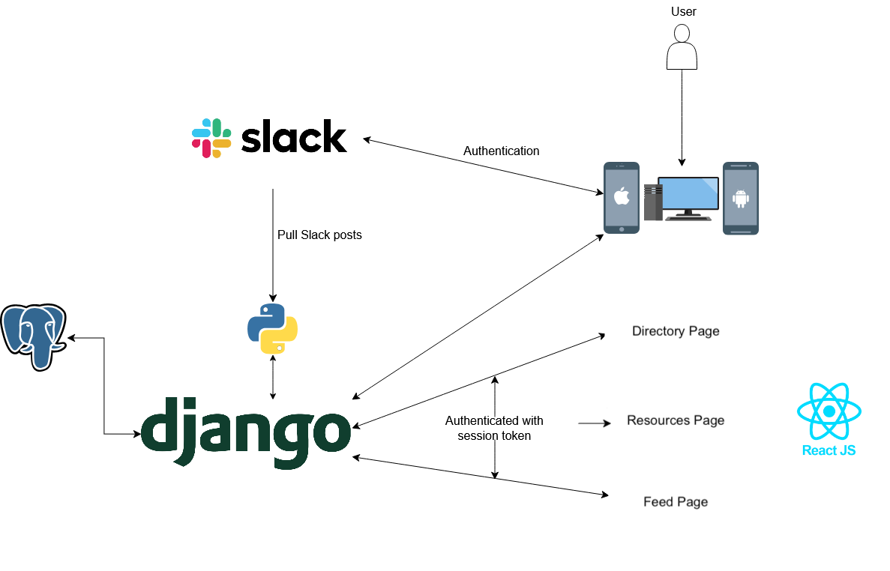

## Data Sources:
- **Slack API**
  Used to:
  - Authenticate users through their Slack accounts
  - Get user info, channels, messages, and events
- **User Input**
  Users interact with features like:
  - Profile setup
  - Posting to the app's community feed
- **PostgreSQL Database**
  Stores:
  - User information
  - Posts and threads
## How Data Moves
When a user signs in through Slack, the app authenticates them using Slack OAuth and stores the necessary tokens. After authentication, any action the user takes (like posting a message or updating a profile) sends a request from the frontend to the backend API. The backend may interact with the Slack API or the PostgreSQL database as needed, then returns a response to update the app interface.

## Main Parts of the App
### 1. Frontend (React Native)
- **Screens**: Home, Feed, Profile
### 2. Backend (Django/Slack API)
- **Handles**: API routes for posts, users, groups, etc.
- **Manages**: Slack OAuth through Django and Slack event handling
- **Connects to**: the database and handles user sessions
### 3. Database (PostgreSQL)

## User Flow (Example)
1. **User opens the app** (mobile or web)
2. **User signs in using Slack** – they're redirected to Slack's OAuth flow and, upon success, redirected back to the app
3. **Backend stores the access token** and user metadata (if new)
4. **User lands on the Home screen** with their profile (on the corner) and feed
5. **User views or posts in the community feed** – the app sends data to the backend
6. **Backend sends the message to Slack** and stores it in the database
7. **Feed updates** in real time or on refresh to reflect the new content
8. **User navigates to other tabs** like Resources or Profiles, which may trigger other API/database calls
